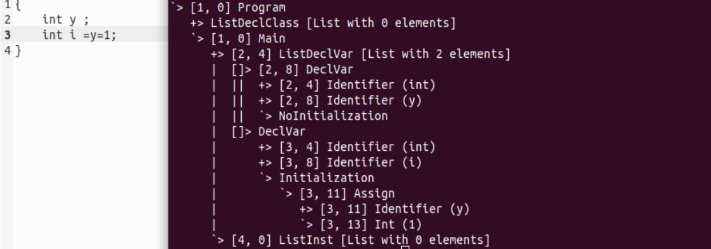
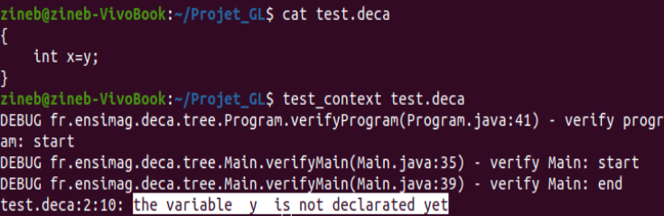
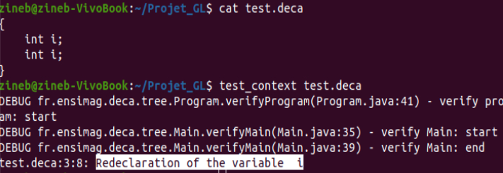
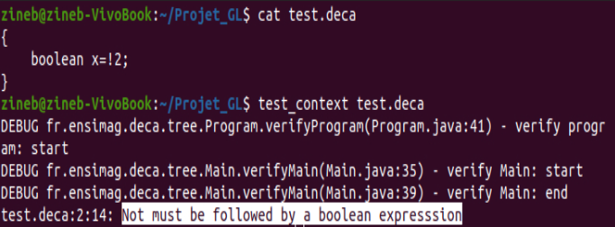
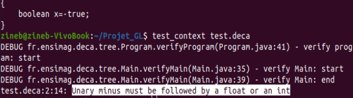
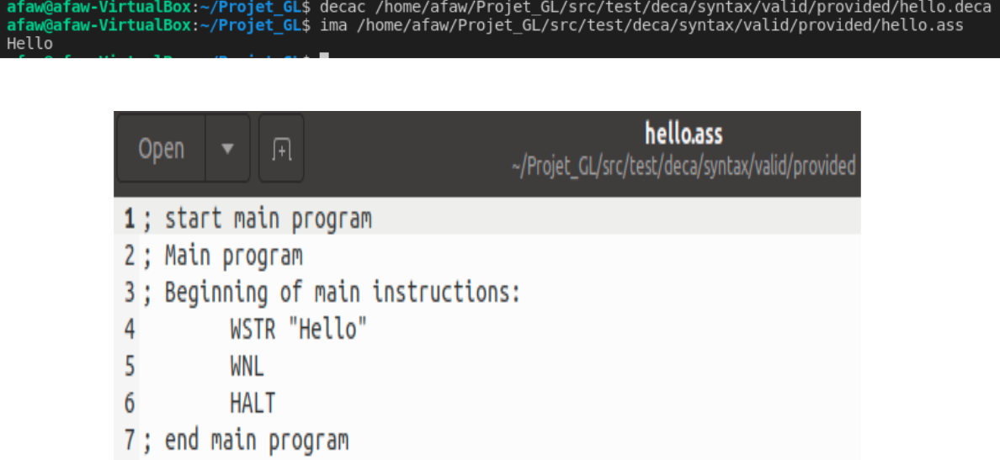

# ProjetGL

Projet "Genie Logiciel", Software Engineering project for Ensimag , is a Java implementation of a compiler for the Deca language (a "mini-Java", a subset of Java with  some variations) .

## 1/ Objectives :

**<u>*Software Engineering :*</u>**

- Edit a  reliable software in the time allotted ;
- Understand and respect a set of specifications ;
- Work in a team and get organized ;
- Experiment with agile development techniques: test-driven development, continuous integration, pair programming ;
- Use development tools: Maven, Git, Jacoco ;

**<u>*Compilation :*</u>**

- Application of the language theory course: implement a compiler
  for the Deca language ;
- Use lexical and syntactic analyzer generators (ANTLR);
- Understand how calculations are translated by machines ;

## 2/ Example of the absract tree corresponding to a simple  deca code : 

## 3/ Example of contextual errors raised by the compiler we implemented : 

## 4/ Example of an assembly code generated by the compiler we implemented and its execution by the abstract machine ima :

## 4/ Explanation of the git repository heirachy :

### 1/  Main directories involved in Part A  ( Lexical and syntactic analysis ):

**src/main/antlr4/fr/ensimag/deca/syntax/ :** Source files for the analyzer generator ANTLR,

**src/main/java/fr/ensimag/deca/syntax/ :** Java source files,

**src/main/java/fr/ensimag/deca/tree/  :** Implementation of the abstract tree (also used in part B and C)

**src/test/java/fr/ensimag/deca/syntax/ :** Java test files

**src/test/script/**  and **src/test/script/launchers/**  : Test scripts (also used in part B and C)

### 2/  Main directories involved in Part B ( Contextual verifications ) :

**src/main/java/fr/ensimag/deca/tree/ :** Implementation of abstract tree paths

**src/main/java/fr/ensimag/deca/context/ :** Java source files

**src/test/java/fr/ensimag/deca/context/ :** Java test files

**src/test/deca/context/ :**  Deca test files.

### 3/  Main directories involved in Part C ( Code generation ) :

**src/main/java/fr/ensimag/deca/tree/ :** Implementation of abstract tree paths 

**src/main/java/fr/ensimag/deca/codegen/ :** Java source files  

**src/test/java/fr/ensimag/deca/codegen/ :** Java test files

**src/test/deca/codegen/ :**  Deca test files.
